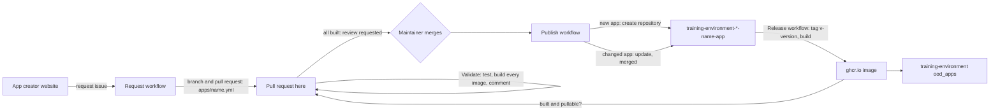

# Training environment app creator

Creates and updates the apps of the REANNZ
[training environment](https://github.com/nesi/training-environment) from a
short description of a workshop.

A trainer fills in the
[app creator website](https://reannz-training-environment.github.io/training-environment-app-creator-website/):
a name, the interfaces (JupyterLab, RStudio, VS Code), the HPC features to
emulate (GPUs, Slurm, environment modules), the data and the software. They
press one button, and the app creator does the rest up to one approval: it
opens a pull request here adding `apps/<name>.yml` and test-builds the app.
Then it asks a maintainer to approve it. Merging the pull request is the
approval. After it, each interface becomes its own repository in this
organisation, and its image is built and released:

```text
training-environment-jupyter-<name>-app
training-environment-rstudio-<name>-app
training-environment-codeserver-<name>-app
```

Each is a complete Open OnDemand app in the same shape as the NeSI apps it is
modelled on, with a Dockerfile, a CI workflow that builds and publishes its
image to `ghcr.io`, and a README with the block that adds it to the training
environment.



## Using it

**Asking for an app.** Fill in the website and press **Create pull request**.
GitHub opens with the request already filled in, as an issue made with the
*Request an app* form: press **Create**. That is all. (A website on GitHub
Pages has no server of its own, so the website itself cannot act on GitHub. It
can if it is given a token, which the website explains; then even the
**Create** is not needed.)

The rest happens by itself:

1. The **Request** workflow checks the spec, commits it as `apps/<name>.yml`
   on the branch `app-request/<issue>`, opens a pull request, and comments on
   the request with its progress. A change to an existing app is given the
   next version if it did not raise the version itself, since only a new
   version is released.
2. The **Validate** workflow tests the spec, builds the image of every
   interface (each image runs a smoke test of every feature it has), and
   comments with the repositories that merging will create or update, and
   [how much space each needs](#how-much-space-an-app-needs).
3. Once every image builds, the `reviewers` in
   [`config/defaults.yml`](config/defaults.yml) are asked to review the pull
   request. If an image does not build, the requester is told instead.
4. **A maintainer approves it, by merging the pull request.** This is the one
   step that waits for a person.
5. The **Publish** workflow creates the repositories (or updates them, merging
   their update pull requests itself), and comments with links to them. Each
   repository's own workflows release `v<version>` and build its image.
6. The app creator follows those builds, checks each image can be pulled the
   way the training environment pulls it, and comments on the pull request,
   telling the requester and whoever merged it, that the app is ready, or what
   is left. The one thing it cannot do is
   [make a new image public](#images-must-be-public-once-per-app): that is
   once per new image, and the comment links to where.
7. Add the app to the training environment with the `ood_apps` block from the
   app repository's README.

Requests from people outside the organisation are not built until a
maintainer adds the `request approved` label to them. Making a request again
for the same app replaces the requester's earlier one.

To try a request again (after a hiccup, or once the GitHub App is set up),
run the **Request** workflow by hand: *Actions*, *Request*, *Run workflow*, with
the request's issue number. That also approves it. Re-running a failed run of
the workflow works too.

### Changing an app

Load the app on the website, change it, and make the request again; or change
`apps/<name>.yml` in a pull request. Merging updates each of the app's
repositories through a pull request there, which the app creator merges
itself, so the new version is released and built. A change that keeps the
version gets no new image, which the pull request's summary warns about.

Files that maintainers add to an app repository by hand are left alone by
updates; edits to generated files are replaced, which the update pull request
shows.

### Deleting an app

Run the **Delete an app** workflow: *Actions*, *Delete an app*, *Run workflow*,
typing the app's name twice. It deletes the app's repositories and their
images, and its spec in `apps/`. Tick *dry run* first to see what it would
delete. It only deletes repositories the app creator made for that app; one
it did not make is left alone, with its image.

GitHub keeps deleted repositories for 90 days and deleted images for 30, and
an organisation owner can restore them from the organisation's settings in
that time.

GitHub does not let a GitHub App delete images. It does let a repository's
own workflows delete the image they published (a GitHub feature still in
public preview). So before deleting each repository, the workflow adds a small
*Delete the image* workflow to it, runs it, and waits for it. That commit is
marked `[skip ci]`, so it doesn't rebuild the image. An image that can't be
deleted that way is listed, with a link to its settings, to delete by hand
under *Danger Zone*.

Instead, a classic personal access token with the `delete:packages` and
`read:packages` scopes, saved as the secret `APP_CREATOR_PACKAGES_TOKEN`, can
delete the images directly. It also deletes the image of a repository that is
already gone. A classic token's scopes cover every organisation its owner
administers, so it is best made by an account that is only in this one.

### Updating every app

Pins (code-server, Lmod, the GPU emulator, kubectl, ...) live in
[`config/defaults.yml`](config/defaults.yml), and the files every app is made
from in [`te_app_creator/templates`](te_app_creator/templates). After changing
either, run the **Publish** workflow by hand with `all` to open an update pull
request in every app repository (or merge them too, with *merge updates*).

## What the options do

The full list is [`schema/app.schema.json`](schema/app.schema.json); the
[examples](examples) use them all.

| Option | What it gives the app |
| --- | --- |
| `interfaces` | One repository per interface. JupyterLab and VS Code apps are Ubuntu 22.04; RStudio apps are `rocker` images (`advanced.rstudio_image`, `advanced.r_version`) |
| `features.gpu` | Emulated NVIDIA GPUs from the NeSI [GPU workshop app](https://github.com/nesi/training-environment-jupyter-gpu-app): `nvidia-smi`, `nvtop`, NVML, optionally PyTorch's `torch.cuda` and Numba's CUDA simulator. `mode: all` puts every listed card on the node; `mode: choose` gives each session one GPU, picked from a menu on the launch form. Always brings the Slurm emulator, which is how a GPU is requested. No physical GPU is involved |
| `features.slurm` | A single-node Slurm emulator in the session (`sbatch`, `squeue`, `sacct`, ...), with NeSI's own `seff` and `svisit` from [opt-nesi-bin](https://github.com/nesi/opt-nesi-bin). Without GPUs it presents a CPU node with the given partition and node name (default `milan`, `c001`) |
| `features.lmod` | Lmod, working in terminals and batch jobs. Conda packages become modules: `module load samtools` |
| `software.conda` | Packages from conda-forge and bioconda, in one environment; each command is on `PATH`, or in its package's module with Lmod |
| `software.pip`, `software.apt` | Python and system packages |
| `software.r` | CRAN, Bioconductor and GitHub R packages, in the RStudio app |
| `software.vscode_extensions` | Open VSX extensions, in the VS Code app |
| `data` | GitHub repositories (at a branch, tag or commit, optionally one folder) and downloads (unpacked if they are archives), baked into the image and copied into each learner's home directory when a session starts. Existing files are never overwritten |
| `resources` | CPUs, memory and the wall time range of a session |
| `advanced.dockerfile`, `advanced.startup` | Extra Dockerfile instructions, and extra commands run at session start. Reviewers should read these |

## How much space an app needs

An app needs space in two places:

* **Its image**, on every worker node that runs it: the programs, and a copy of
  the data. The training environment's `worker_disksize` has to hold the
  images of every app that is pre-pulled.
* **Its data**, in every learner's home directory: each session copies the
  data in, so the home directory server needs the data's size once per learner.

Both are measured exactly when the Validate workflow test-builds the app's
images (`python -m te_app_creator sizes`). The pull request comment gives each
image's download and on-disk size, the data each learner gets, and what each
part of the app adds: every data source, and every kind of software. Each of
those is its own Dockerfile step, so this comes from the image's layer history.
For an app request, the request's status comment also gives the requester the
totals: each image's size, and the data per learner and for 30 learners.

## Setting up

### The GitHub App (once)

The workflows act as the app creator's GitHub App. The workflow's own
`GITHUB_TOKEN` cannot create repositories, and a pull request it opens starts
no checks. Until the App is set up, requests and Publish say so and stop;
Validate works without it.

An owner of the organisation makes it with one command, with the
[GitHub CLI](https://cli.github.com) signed in:

```bash
pip install -r requirements.txt
python -m te_app_creator setup-app
```

The browser opens on GitHub's page for creating the App, with everything
filled in: press **Create GitHub App**. The command stores the App's client ID
in the variable `APP_CREATOR_CLIENT_ID` and its private key in the secret
`APP_CREATOR_APP_PRIVATE_KEY` of this repository. The key is never written to
disk. Then GitHub's page for installing the App opens: choose the organisation
and **All repositories**, so it can manage the repositories it creates, and
press **Install**.

The App gets only what the workflows need: Administration (to create the app
repositories), Contents and Workflows (to push their files, and requests'
specs here), Pull requests (to open and merge them) and Issues (to answer
requests), all *read and write*, and the organisation's Members, *read-only*.
Members lets it recognise requests from people whose membership of the
organisation is private, which GitHub otherwise reports as outsiders'. Without
it, only the reviewers and people with write access are recognised. Other
members' requests then wait for a maintainer's `request approved` label.

An App made before Members was added gets it from its settings: *Permissions &
events*, *Organization permissions*, *Members: Read-only*, *Save changes*. Then
accept the change on the installation (the organisation's *GitHub Apps*
settings show the request).

Instead of the App, a fine-grained personal access token with those
permissions on all the organisation's repositories can be saved as the secret
`APP_CREATOR_TOKEN`; Publish uses it, but requests need the App.

### Images must be public, once per app

The cluster pulls images from `ghcr.io` without credentials. A new package is
private even when its repository is public, and GitHub has no API to change
that. So after each new app's first images are built, someone with admin
rights opens each one's
`https://github.com/orgs/reannz-training-environment/packages/container/<repository>/settings`
and uses *Change visibility* to make it public. The app creator's comment on
the merged pull request says which images are still private and links to each.
Each app's build workflow also warns until its image is public. Later versions
of an app stay public.

### Who approves

`reviewers` in [`config/defaults.yml`](config/defaults.yml) are asked to
review each request's pull request once its images build. Anyone who can merge
pull requests here can approve a request. People in the organisation only need
*read* access to make requests.

## Working on the generator

```bash
pip install -r requirements.txt
python -m pytest -q                                   # the generator's tests
python -m te_app_creator validate                     # every apps/*.yml
python -m te_app_creator render examples/kitchen-sink.yml -o build
python -m te_app_creator summary examples/slurm-cpu.yml
docker build --platform linux/amd64 build/training-environment-jupyter-slurm-cpu-app/docker
```

`publish` needs `APP_CREATOR_TOKEN` (or `GH_TOKEN`) in the environment, and has
a `--dry-run`.

| Path | |
| --- | --- |
| `apps/` | one spec per app; what the website adds |
| `examples/` | specs that use every option, built by CI when the templates change |
| `schema/app.schema.json` | what a spec may contain |
| `config/defaults.yml` | the organisation, registry and every version pin |
| `te_app_creator/spec.py` | loads, checks and fills in specs |
| `te_app_creator/render.py` | turns a spec into the files of one app per interface |
| `te_app_creator/request.py` | turns a request issue into a pull request, and hands it over for approval |
| `te_app_creator/publish.py` | creates repositories, or updates them through pull requests |
| `te_app_creator/ready.py` | follows the release builds, and checks the images can be pulled |
| `te_app_creator/delete.py` | deletes an app's repositories, images and spec |
| `te_app_creator/setup_app.py` | makes the GitHub App |
| `te_app_creator/templates/` | the app files: `common/` for every interface, then `jupyter/`, `rstudio/`, `codeserver/` |
| `.github/ISSUE_TEMPLATE/app-request.yml` | the request form the website fills in |
| `.github/workflows/request.yml` | turns requests into pull requests |
| `.github/workflows/validate.yml` | tests, test-builds and comments on pull requests; hands requests over |
| `.github/workflows/publish.yml` | publishes merged specs, and says when their images are ready |
| `.github/workflows/delete.yml` | deletes an app, run by hand |

Every generated repository records what it was generated from in
`.app-creator.json`. Publish only updates repositories that have one, so it
never overwrites a repository it did not make.

## Limitations

* The emulators are teaching scaffolds. Emulated GPUs compute on the CPU, so
  no timing means anything about GPU performance. Slurm is one node, first come
  first served, and jobs start with the session's environment rather than the
  environment `sbatch` ran in.
* Data sources must be public, and are not Git LFS aware. Very large datasets
  are better provisioned into home directories by the training environment
  itself, as `provision_data_scrnaseq` does.
* An app's name cannot change once its repositories exist: a new name makes new
  repositories.
* Removing an interface from a spec, or deleting a spec by hand, leaves its
  repositories in place; the *Delete an app* workflow removes them all.
