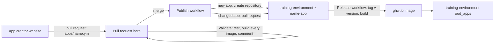

# Training environment app creator

Creates and updates the apps of the REANNZ
[training environment](https://github.com/nesi/training-environment) from a
short description of a workshop.

A trainer fills in the
[app creator website](https://reannz-training-environment.github.io/training-environment-app-creator-website/):
a name, the interfaces (JupyterLab, RStudio, VS Code), the HPC features to
emulate (GPUs, Slurm, environment modules), the data and the software. The
website opens a pull request here adding `apps/<name>.yml`. When it is merged,
each interface becomes its own repository in this organisation:

```text
training-environment-jupyter-<name>-app
training-environment-rstudio-<name>-app
training-environment-codeserver-<name>-app
```

Each is a complete Open OnDemand app in the same shape as the NeSI apps it is
modelled on, with a Dockerfile, a CI workflow that builds and publishes its
image to `ghcr.io`, and a README with the block that adds it to the training
environment.



## Using it

1. Fill in the website and press **Create pull request**. Without a token, the
   website opens GitHub's editor with the file filled in: choose *Create a new
   branch for this commit and start a pull request*. With a token (see the
   website), it opens the pull request itself.
2. The **Validate** workflow tests the spec, builds the image of every
   interface (each image runs a smoke test of every feature it has), and
   comments with the repositories that merging will create or update.
3. Merge. The **Publish** workflow creates the repositories and comments with
   links to them. Each new repository's own workflows release `v<version>` and
   push its image, which takes a few minutes.
4. Make each new image public ([once per app](#images-must-be-public-once-per-app)).
5. Add the app to the training environment with the `ood_apps` block from the
   app repository's README.

### Changing an app

Change `apps/<name>.yml` in a pull request (the website can load an existing
app with a token, or edit the file on GitHub). On merge, each of the app's
repositories gets a pull request with the regenerated files. Bump `version` to
release the change: merging the app repository's pull request then tags the
new version and builds its image.

Files that maintainers add to an app repository by hand are left alone by
updates; edits to generated files are replaced, which the update pull request
shows.

### Updating every app

Pins (code-server, Lmod, the GPU emulator, kubectl, ...) live in
[`config/defaults.yml`](config/defaults.yml), and the files every app is made
from in [`te_app_creator/templates`](te_app_creator/templates). After changing
either, run the **Publish** workflow by hand with `all` to open an update pull
request in every app repository.

## What the options do

The full list is [`schema/app.schema.json`](schema/app.schema.json); the
[examples](examples) use them all.

| Option | What it gives the app |
| --- | --- |
| `interfaces` | One repository per interface. JupyterLab and VS Code apps are Ubuntu 22.04; RStudio apps are `rocker` images (`advanced.rstudio_image`, `advanced.r_version`) |
| `features.gpu` | Emulated NVIDIA GPUs from the NeSI [GPU workshop app](https://github.com/nesi/training-environment-jupyter-gpu-app): `nvidia-smi`, `nvtop`, NVML, optionally PyTorch's `torch.cuda` and Numba's CUDA simulator. `mode: all` puts every listed card on the node; `mode: choose` gives each session one GPU, picked from a menu on the launch form. Always brings the Slurm emulator, which is how a GPU is requested. No physical GPU is involved |
| `features.slurm` | A single-node Slurm emulator in the session (`sbatch`, `squeue`, `sacct`, ...), with NeSI's own `seff` and `svisit` from [opt-nesi-bin](https://github.com/nesi/opt-nesi-bin). Without GPUs it presents a CPU node with the given partition and node name (default `milan`, `c001`) |
| `features.lmod` | Lmod, working in terminals and batch jobs. Conda packages become modules: `module load samtools` |
| `software.conda` | Packages from conda-forge and bioconda, in one environment; each command is on `PATH`, or in its package's module with Lmod |
| `software.pip`, `software.apt` | Python and system packages |
| `software.r` | CRAN, Bioconductor and GitHub R packages, in the RStudio app |
| `software.vscode_extensions` | Open VSX extensions, in the VS Code app |
| `data` | GitHub repositories (at a branch, tag or commit, optionally one folder) and downloads (unpacked if they are archives), baked into the image and copied into each learner's home directory when a session starts. Existing files are never overwritten |
| `resources` | CPUs, memory and the wall time range of a session |
| `advanced.dockerfile`, `advanced.startup` | Extra Dockerfile instructions, and extra commands run at session start. Reviewers should read these |

## One-time setup

### A token that can create repositories

The workflow's own `GITHUB_TOKEN` cannot create repositories, so **Publish**
needs one of these. Until one is set up, Publish fails with a message saying
so; Validate works without it.

**A GitHub App (recommended).** Organisation settings → Developer settings →
GitHub Apps → New GitHub App:

* no webhook, no callback URL
* repository permissions: Administration *read and write*, Contents *read and
  write*, Pull requests *read and write*, Workflows *read and write*
* install it on this organisation, for all repositories

Then, in this repository's settings → Secrets and variables → Actions, add the
App's ID as the variable `APP_CREATOR_APP_ID` and a private key of the App as
the secret `APP_CREATOR_APP_PRIVATE_KEY`.

**Or a fine-grained personal access token** with resource owner
`reannz-training-environment`, access to all repositories, and the same four
permissions, saved as the secret `APP_CREATOR_TOKEN`. Simpler, but it acts as
the person who made it, and it expires.

### Images must be public, once per app

The cluster pulls images from `ghcr.io` without credentials. A new package is
private even when its repository is public, and GitHub has no API to change
that, so after each new app's first image is pushed, someone with admin rights
opens `https://github.com/orgs/reannz-training-environment/packages/container/<repository>/settings`
and uses *Change visibility* to make it public. The Publish comment links to
the settings of every repository it creates, and each app's build workflow
warns until its image is public.

### Pull requests for every change

The website's no-token route lets a user commit to `main` directly if they
choose to. On a private repository with the free plan, GitHub cannot require
pull requests; making this repository public, or upgrading the plan, allows a
branch rule that does.

## Working on the generator

```bash
pip install -r requirements.txt
python -m pytest -q                                   # the generator's tests
python -m te_app_creator validate                     # every apps/*.yml
python -m te_app_creator render examples/kitchen-sink.yml -o build
python -m te_app_creator summary examples/slurm-cpu.yml
docker build --platform linux/amd64 build/training-environment-jupyter-slurm-cpu-app/docker
```

`publish` needs `APP_CREATOR_TOKEN` (or `GH_TOKEN`) in the environment, and has
a `--dry-run`.

| Path | |
| --- | --- |
| `apps/` | one spec per app; what the website adds |
| `examples/` | specs that use every option, built by CI when the templates change |
| `schema/app.schema.json` | what a spec may contain |
| `config/defaults.yml` | the organisation, registry and every version pin |
| `te_app_creator/spec.py` | loads, checks and fills in specs |
| `te_app_creator/render.py` | turns a spec into the files of one app per interface |
| `te_app_creator/publish.py` | creates repositories, or opens update pull requests |
| `te_app_creator/templates/` | the app files: `common/` for every interface, then `jupyter/`, `rstudio/`, `codeserver/` |
| `.github/workflows/validate.yml` | tests, test-builds and comments on pull requests |
| `.github/workflows/publish.yml` | publishes merged specs |

Every generated repository records what it was generated from in
`.app-creator.json`. Publish only updates repositories that have one, so it
never overwrites a repository it did not make.

## Limitations

* The emulators are teaching scaffolds. Emulated GPUs compute on the CPU, so
  no timing means anything about GPU performance. Slurm is one node, first come
  first served, and jobs start with the session's environment rather than the
  environment `sbatch` ran in.
* Data sources must be public, and are not Git LFS aware. Very large datasets
  are better provisioned into home directories by the training environment
  itself, as `provision_data_scrnaseq` does.
* An app's name cannot change once its repositories exist: a new name makes new
  repositories.
* Removing an interface from a spec, or deleting a spec, leaves its
  repositories in place.
